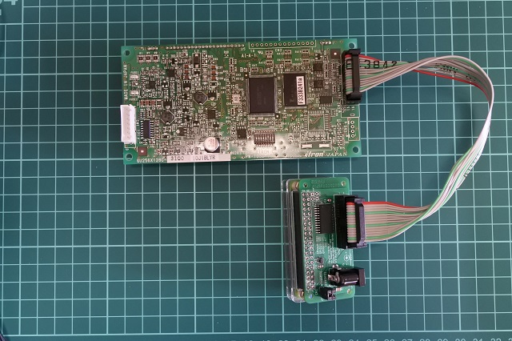
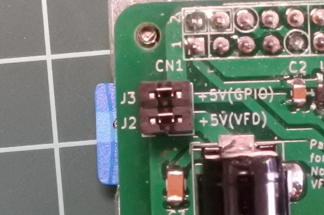
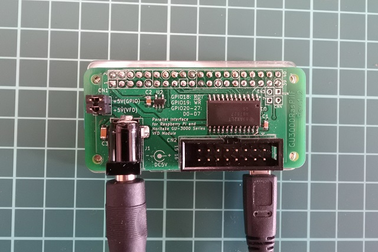
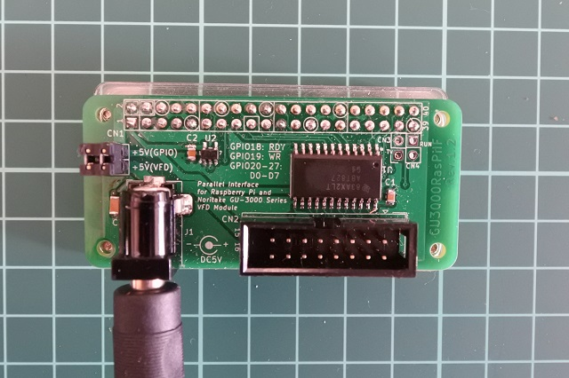
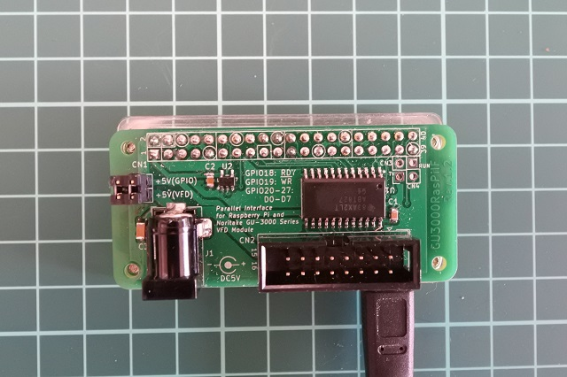
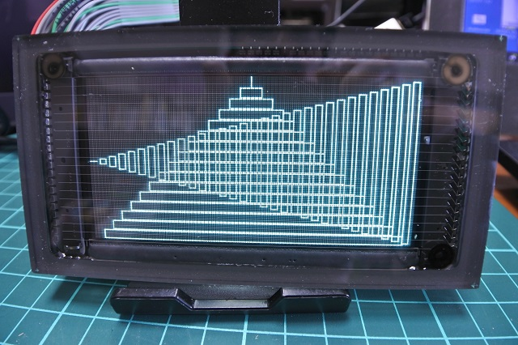

# Noritake Itron GU3000シリーズ VFDモジュール用Raspberry Piパラレルインターフェース説明書
## Rev. 2021/3/11
この文書は，Noritake Itron GU3000シリーズ VFDモジュール用に作成したインターフェースについて説明するものです．
インターフェースボードやプログラムは，
ノリタケ伊勢電子株式会社(以下，Noritake Itron)とは一切関係のない個人が開発したものです．

# 開発環境および実行環境
## ハードウェア
- Noritake Itron GU256x128C-3100
- Raspbery Pi (4 および zero W)
- GU3000RasPiIF(レベル変換用インターフェース(自作))

## OS
Raspberry Pi ImagerでRaspbian(32bit版)をSDメモリに書き込んだもの．

- Raspbery Pi Zero W
  - OS: Raspbian (Linux raspberrypi 5.4.79+ #1373)
- Raspberry Pi 4
  - OS: Raspbian (Linux raspberrypi 5.4.72-v7l+ #1356)

# 使用方法
## VFDモジュールDIPスイッチの設定 ★★★重要★★★
コマンドモード選択(SW1 No.6): ON グラフィックDMAモードに設定します．
(ソフトウェア仕様書 6.1.3 コマンドモード選択 参照)


## ラズベリーパイとVFDの接続
インターフェースボードをラズベリーパイのGPIOコネクタに接続  


インターフェースボードとVFDをケーブルで接続  


結線は下記のようになっています．
```
Raspberry Pi 4/ Zero/ Zero W
GPIO
18  19  20...27
^  
|   |   | ...|  3.3V
 Level converter 
|   |   | ...|  5.0V
    v   v    v
RDY WR_ D0...D7
VFD module
```
## 電源の接続

### VFDへの電源供給について
電源: DC 5V (プラグ内径2.1mm/外径5.5mm, センタープラス)
VFDの最大消費電流(全画素点灯時)は1.1Aです．

基板上のピンヘッダにより、
GPIOの5VとVFD(インターフェースボードからの給電)の5Vを
接続することができます．
これにより、Raspberry PiにGPIO経由で給電することもできます．
その場合には、それにあわせて十分な容量の電源をご用意下さい．

逆に、GPIOからの給電でVFDを動作させることも出来ますが、
その場合もRaspberry Pi側の電源の容量を十分に確保して下さい．

Raspberry Pi側給電と、VFD(インターフェースボード)側の給電で
2つのACアダプタを使用する場合には、
GPIO_VCCとVFD_VCCを切り離して下さい．
接続した状態で2つのACアダプタを使用すると、電源が並列に接続されるため、
電位差による逆流によってACアダプタに悪影響を及ぼすおそれがあります．


### ラズベリーパイとVFDそれぞれに別の電源を接続する場合の設定
J2とJ3を切り離す(横向きジャンパー)  


ラズベリーパイ，インターフェースボードそれぞれ電源に接続する


### ラズベリーパイとVFDの電源をを共有する設定
J2(+5V(VFD))とJ3(+5V(GPIO)を接続する．(縦向きジャンパー)


インターフェースボードを電源に接続する．  


又は，ラズベリーパイを電源に接続する．  


## ソフトウェア
### 事前にインストールが必要なもの
GPIO制御にwiringPi( http://wiringpi.com/ )を使用しています．
おそらくraspbianに標準でインストールされていますが，
もしインストールされていない場合は下記コマンドでインストールして下さい．
```
sudo apt install wiringpi
```
### ライブラリのbuild
```
git clone https://github.com/ryomuk/gu3000.git
cd gu3000/src
make
cd examples
./make.sh (もしくは，サブディレクトリでmake)
```
ライブラリの使用方法は，LibraryManual.mdおよびサンプルプログラムのソースを見て下さい．

## サンプルプログラム
サンプルプログラムです．使い方はソースを見て下さい．

### hello
とりあえず最小のサンプルプログラム．
```
cd gu3000/src/examples/hello
make
./hello
```


### test
簡単な描画と速度の測定．
```
cd gu3000/src/examples/test
make
./test
```


### fonttest
ライブラリに実装されたフォントの表示．
```
cd gu3000/src/examples/fonttest
make
./fonttest
```

MICR(Magnetic Ink Character Recognition) like font.  


Hitachi H68/TR 7-segment LED console font.  


### showwire
ワイヤーフレームモデルの描画．下記のサイトにいろいろなデータがあります．
https://people.sc.fsu.edu/~jburkardt/data/obj/obj.html
```
cd gu3000/src/examples/showwire
make
./showwire teapot.obj
```
↓クリックで動画再生  
[](https://www.youtube.com/watch?v=gbkjLUjZCEo "showwire teapot.obj")

### lifegame
ライフゲーム(Conway's Game of Life)です．
```
cd gu3000/src/examples/lifegame
make
./lifegame
```


### playbmp
ビットマップ動画(ffmpegのrawvideo)を再生します．
```
cd gu3000/src/examples/playbmp
make
ffmpeg -i sample.mp4 -s 128x256 -pix_fmt monob -c:v rawvideo -f rawvideo -vf transpose=0 -an - | ./playbmp
又は
./play.sh
```
raspberry pi zeroだとCPUパワーが足りないので，一旦ファイルにrawvideoのデータを作って再生します．
```
ffmpeg -i sample.mp4 -s 128x256 -pix_fmt monob -c:v rawvideo -f rawvideo -vf transpose=0 -an - > sample.bmp
又は
./makebmp.sh
./playbmp sample.bmp
```

Bad Apple!! クリックして再生↓  
[](https://www.youtube.com/watch?v=wEan5ha9sWA "playbmp")

### showbmp
bmpファイルを表示します．
```
cd gu3000/src/examples/showbmp
make
./showbmp 256128sample.bmp
```


### viewtxt
テキストを表示します．フォントの選択ができます．
```
cd gu3000/src/examples/viewtxt
make
./viewtxt sample.txt
```
フォントの名前一覧を表示
```
./viewtxt -l
```


### clear
画面をクリアしたり，ビットパターンで埋めたり，輝度を設定します．
```
cd gu3000/src/examples/clear
make
./clear        (画面を消去します)
./clear 0xaa   (表示バッファを0xaaで埋めます)
./clear 0xaa 1  (表示バッファを0xaaで埋めて，輝度1を設定します)
```
### brigntness
表示されている画面の輝度を変更します．
輝度の値は0(消灯)〜4(全灯)，又は(16(消灯)〜24(全灯)です．
```
cd gu3000/src/examples/brightness
make
./brightness 1
```

# コンソール画面，Xwindowについて
コンソール画面の表示や，Xwindowが起動できましたが，いろいろと試行錯誤してとりあえず出来たという感じなので，これが正しい方法かどうかは不明ですが，
とりあえず私がやったことをまとめておきます．

## /dev/fb0を利用した描画
Raspberry Piの/dev/fb0を逐次(50ms毎等)VFDモジュールの表示メモリに
コピーすることによって，
コンソール画面やXwindowの画面を表示させることができます．
上に紹介したサンプルプログラム類を同時に走らせると画面のちらつきが発生したり，正しく描画できないことがあるのでご注意下さい．

下記方法は，HDMI出力を止めて/dev/fb0をVFDに表示するものです．
HDMIからの画面出力はできなくなりますので，
事前に，ssh等でリモートでログインできる環境を整えて下さい．

私は面倒なのであきらめましたが，HDMIと両立させる方法もあるかと思いますので，
両立させたい場合は適宜設定して下さい．

## console
### フレームバッファ/dev/fb0をVFDに表示するための設定
1. /dev/fb0 を作成 (HDMI出力は外す)
/boot/config.txtに以下を追加
```
framebuffer_height=128	
framebuffer_width=256
hdmi_cvt=256 128 60 3 0 0 0
hdmi_group=2
hdmi_mode=87
hdmi_force_hotplug=1
```

2. コンソール用フォントconsolefonts-extra/*.psf を/usr/share/にコピー．
3. dev/fb0 をVFDに逐次表示するコマンド examples/showfb, examples/showfb.sh
を/usr/local/binにコピー．
4. それらコマンドをサービスとして起動するための設定．サービスを有効化．

```
cd gu3000/src/examples/showfb
make
sudo cp -a consolefonts-extra /usr/share/
sudo cp showfb /usr/local/bin/
sudo cp showfb.sh /usr/local/bin/
sudo cp showfb.service /etc/systemd/system/
sudo systemctrl enable showfb.service
```

無効化したい場合は，下記のコマンドを実行．
```
sudo systemctrl stop showfb.service
```

リブートすると，VFDにコンソール画面が表示されます．


## コンソール用のフォントについて
/usr/share/consolefonts にあるフォントはどれも大きいので，
小さめのフォントデータを作りました．
ライブラリ用に作ったフォントをテキストファイルに出力してから
rw-psf(https://github.com/talamus/rw-psf )でpsfファイルにするのが
簡単だったので，そのようにしました．詳細は下記のスクリプトを参照して下さい．
これで作ったデータが gu3000/src/examples/showfb/consolefonts-extra/*.psf です．
```
cd gu3000/src/examples/font2txt
make
./makepsf.sh
```

## Xwindow
### Xorg用設定
gu3000/src/examples/showfb/xorg.confを/etc/X11/xorg.confにコピー．
ラズパイ標準のX環境は小画面ではほとんど使えないので，
小画面用のwindow manager(twm)を使う．
.xsessionをユーザのホームディレクトリに置く．
X用のフォントもインストールする．

```
cd gu3000/src/examples/showfb
sudo cp xorg.conf /etc/X11/
sudo apt install twm
sudo apt install xfonts-base
cp dot.xsession ~/.xsession
cp dot.twmrc ~/.twmrc
```

rebootしてコンソール画面でログインしてxサーバを起動．
```
startx
```


↓クリックして動画を再生  
[](https://www.youtube.com/watch?v=z8M9jezuZ1E "Bad Apple on Xwindow")

## おまけ
### ノーマルコマンドモード用ライブラリについて
ノーマルコマンドモードは，描画処理をモジュール上のプロセッサで行うモードです．
DIPスイッチの切り替えが必要なのと，通信オーバヘッドが大きく遅いので，
対応するライブラリは途中まで作成して放置してあります．

```
gu3000normal.cpp
gu3000normal.h
examples.normalmode/
```

### ノーマルコマンド使用方法
コマンドモード選択(SW1 No.6): OFF ノーマルコマンドモードに設定します．
(ソフトウェア仕様書 6.1.3 コマンドモード選択 参照)

## 参考文献
Noritake Itronの下記サイトから現行品(GU3900B)の技術資料が入手可能です．
本プログラムで動作確認しているモジュールは旧製品のGU3100ですが，基本的な部分は同じようでした．

[https://www.noritake-itron.jp/products/module/gu-3000](https://www.noritake-itron.jp/products/module/gu-3000)
- 「ディスプレイモジュールハードウェア仕様書」DS-1604-000-04, 2015年6月1日改訂
- 「ディスプレイモジュール3900Bシリーズ"基本機能"ソフトウェア仕様書」DS-1600-0007-00, 2010年11月29日制定
- 「蛍光表示管モジュール「GU-3000 シリーズ モジュール」アプリケーションノート」
APF300 R1.72
